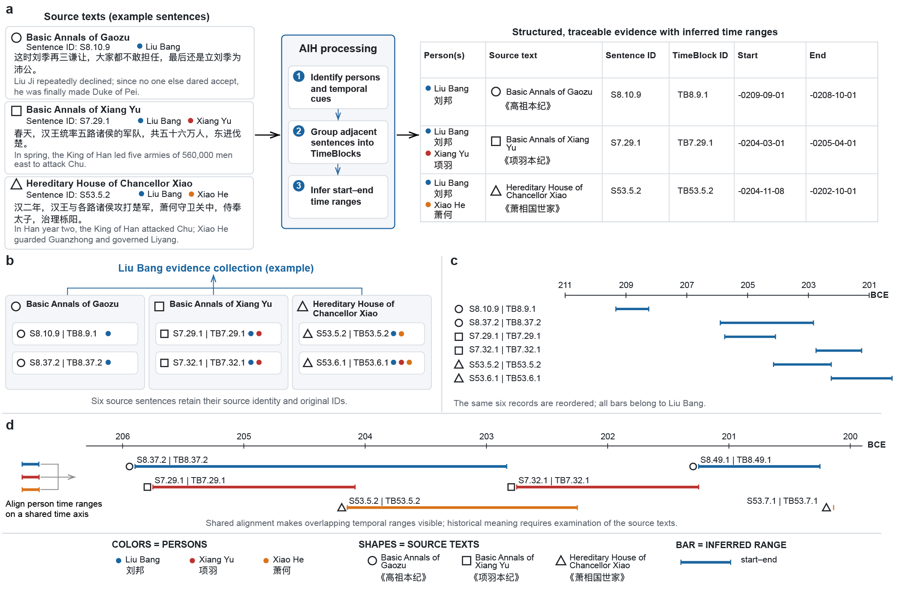
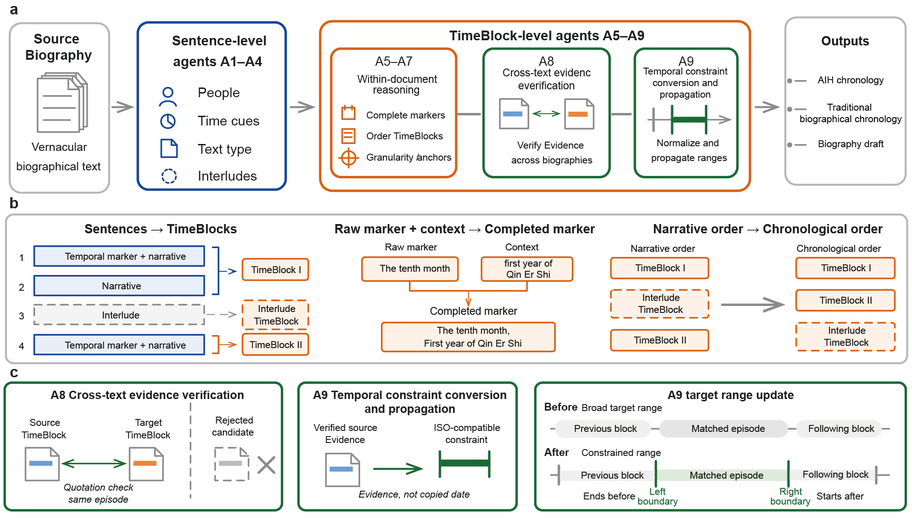
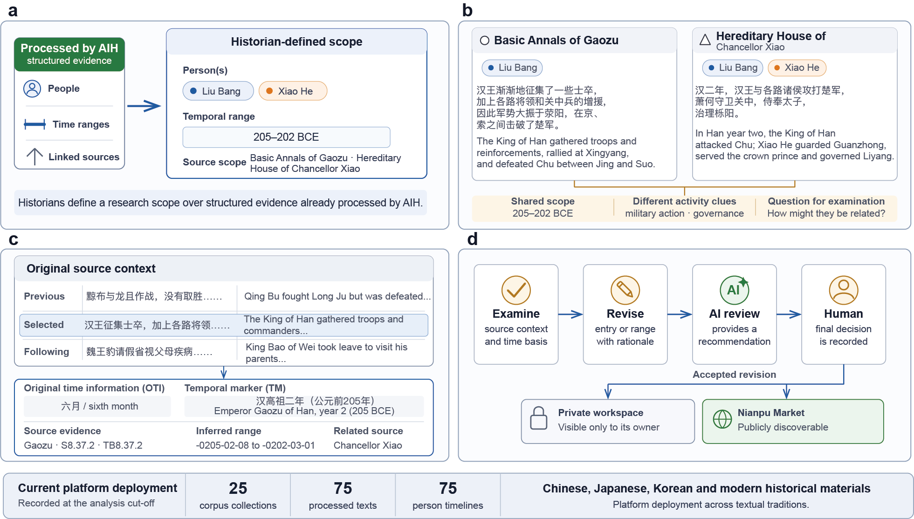

# AI Historian

<p align="center">
  
</p>

<p align="center">
  <a href="README.md">English</a> · <strong>中文</strong>
</p>

<p align="center">
  <a href="https://westlakehistorian.com">公开平台</a> ·
  <a href="results.md">实验结果</a> ·
  <a href="experiments/human-baselines.md">人工基线</a> ·
  <a href="docs/model-configuration.zh-CN.md">模型配置</a> ·
  <a href="data-licenses.md">数据条款</a> ·
  <a href="docs/fulltext/README.zh-CN.md">全文 Agent</a> ·
  <a href="CITATION.cff">引用</a>
</p>

<p align="center"><strong>版本 1.0.0</strong></p>

本仓库是论文 **《AI Historian: Helping historians organize and verify person-centred temporal clues from dispersed historical narratives》** 的官方实现与复现材料仓库。

AI Historian（AIH）把分散在人物传记和历史叙事中的句子组织为可追溯的“人物—时间”证据。系统抽取人物与原文时间信息，构建 TimeBlock，恢复编年顺序，核验跨文本关系，并将获得证据支持的判断规范化为可比较的时间范围。



## 快速开始

### 1. 安装环境

环境要求：Python 3.10 或更高版本。重新计算冻结实验指标还会使用 Node.js 18 或更高版本。

```bash
uv sync --locked
```

`pyproject.toml` 是依赖和打包配置的唯一事实来源，`uv.lock` 锁定完整运行环境。
如果本机尚未安装，请先安装 [uv](https://docs.astral.sh/uv/)。下文命令均通过
`uv run` 在锁定环境中执行。

### 2. 配置底层模型

实验版 Agent、两个实验入口和可扩展全文 Agent 共用一套配置接口。

```bash
cp .env.example .env
# 选择 provider 和模型，然后填写该厂商对应的 API key。
uv run python scripts/check_model_config.py --env-file .env
```

加载配置：

```bash
set -a
source .env
set +a
```

根模板包含 OpenAI、Anthropic、DeepSeek、Gemini、DashScope 和通用 OpenAI-compatible endpoint 的厂商原生凭证组。严格选择规则、embedding 设置、模型资格检查和可选端点测试见[底层模型配置指南](docs/model-configuration.zh-CN.md)。

### 3. 运行最小示例

仓库自带一份小型中文合成传记文本
`examples/input/liu-bang-synthetic-biography.txt`。人物和篇章标题单独声明在
`examples/input/manifest.json` 中；文件名只使用小写 kebab-case，不再承担元数据
解析。文本中的空行用于分隔段落。

```bash
sed -n '1,20p' examples/input/liu-bang-synthetic-biography.txt
sed -n '1,40p' examples/input/manifest.json
```

首先可以运行确定性的本地预处理阶段，检查文件发现、段落切分、句子切分和稳定
句子标识符是否正常：

```bash
uv run aih examples/input \
  --output runs/quickstart-preprocess \
  --through-step 1

find runs/quickstart-preprocess -maxdepth 3 -type f | sort
```

加载第 2 步的模型配置后，运行完整的实验对齐版 Agent：

```bash
uv run aih examples/input --output runs/quickstart
```

运行目录会保留各阶段的中间表示：句子级 JSON 位于 `sentence/`，构建后的
TimeBlock 位于 `timeblock/`，编年排序结果位于 `sequence/`。可以用以下命令
查看生成的文件：

```bash
find runs/quickstart -maxdepth 3 -type f | sort
find runs/quickstart/timeblock/step11output \
  -maxdepth 1 -type f -name '*.json' | sort
```

如果同一输入目录包含多份相互关联的来源文本，可以加入 `--cross-document`
启用经过证据核验的跨文档对齐；如需在时间规范化后生成便于阅读的摘要，再加入
`--summaries`：

```bash
uv run aih examples/input \
  --output runs/quickstart-crossdoc \
  --cross-document \
  --summaries
```

处理完整文本或更大的多文档集合时，使用同一输入运行可扩展全文 Agent：

```bash
uv run aih-fulltext examples/input --output runs/quickstart-fulltext
```

处理新语料时，把采用小写 kebab-case 命名的 UTF-8 `.txt` 文件放在同一目录，
并在 `manifest.json` 中明确描述每个文件。原始文本使用独立的语料目录，`runs/`
专门保存运行输出；每套配置使用不同的输出目录，以便直接比较不同模型和 Agent
版本。输入 manifest 及流水线写出的句子与 TimeBlock 字段见[数据格式](docs/data-format.md)。

## 选择运行版本

AIH 围绕相同的 A1–A9 语义方法提供两套执行版本：

| 版本 | 入口 | 适用场景 | 跨文档输入范围 |
| --- | --- | --- | --- |
| **实验评估 profile** | `uv run aih` | 论文实验和紧凑研究语料 | 预先限定的案例包 |
| **可扩展全文 profile** | `uv run aih-fulltext` | 完整文本、多文档集合和平台化处理 | 运行时检索并构建包含时间锚点的紧凑 `episode_packet` |

两种 profile 都位于 `ai_historian` 包内，并保留 TimeBlock、来源追踪、跨文本证据核验和规范化时间范围。论文报告的指标对应冻结实验 profile。阶段级差异见[profile 对照](docs/profiles.zh-CN.md)和[全文 Agent 指南](docs/fulltext/README.zh-CN.md)。

## 复现论文材料

仓库收录冻结输入、中间阶段、模型输出、耗时记录、共识预测和评分程序。[results.md](results.md) 是全部论文结果的统一索引。
论文复现属于仓库级工作流，因此通过 `scripts/reproduce_paper.py` 调用，不作为 wheel 的命令行入口安装。

一条命令完成全部冻结材料的确定性检查：

```bash
uv run python scripts/reproduce_paper.py frozen
```

配置模型端点后，以下命令从实验输入开始完成实验一的三次独立 AIH 运行、逐行
共识和 MicroIoU 评分，并运行实验二的两种模型条件、共识生成、人工指标及最终
对比：

```bash
uv run python scripts/reproduce_paper.py full --env-file .env
```

从冻结共识预测重新计算实验一 MicroIoU：

```bash
node experiments/experiment-1/evaluation/score_ai_prefill_variant.js
```

重新生成实验二的人工指标和最终对比：

```bash
node experiments/experiment-2/code/build_human_accuracy.js
node experiments/experiment-2/code/build_strict_total_html.js
```

运行预处理、TimeBlock、MicroIoU、时间范围规范化、跨文本约束和配置加载测试：

```bash
uv run python -m unittest discover -s tests -v
```

准确输入输出路径、指标定义和完整生成流程见[复现说明](docs/reproducibility-guide.md)、[实验一](experiments/experiment-1/README.md)和[实验二](experiments/experiment-2/README.md)。

## 关键实验结果

### 实验一：端到端人物时间范围重建

| 条件 | MicroIoU | 累计用时 |
| --- | ---: | ---: |
| **AIH Agent** | **86.2%** | **13 分 56 秒** |
| 纯人工标注 | 81.3% | 1 小时 32 分 |
| 直接提示大语言模型 | 17.1% | 2 分 28 秒 |

该实验覆盖六个《史记》案例中的 244 个有效句子级时间范围。

公开的[实验一人工基线结果包](experiments/experiment-1/results/human/)包含逐句 Human-only、Human+AI 响应、逐案例得分和用时记录。

### 多模型复现实验

| 底层模型 | AIH Agent | 直接提示 |
| --- | ---: | ---: |
| DeepSeek-V4-Flash（非思考模式） | 90.2% | 15.4% |
| GPT-5.6 SOL | 86.9% | 17.9% |
| Gemini 3.1 Pro | 88.6% | 14.6% |
| Claude Opus 5 | **90.7%** | 14.3% |
| Qwen 3.6 | 78.6% | 15.0% |

表中数值是六个案例级 MicroIoU 的描述性宏平均。完整来源表格和各模型实验材料均由 [results.md](results.md) 索引。

### 实验二：关键推理环节诊断

| 条件 | 总体严格准确率 | 跨文本事件核验与时间对齐 |
| --- | ---: | ---: |
| 人工 | 64.6% | 95.8% |
| 直接提示大语言模型 | 68.8% | 75.0% |
| **结构化大语言模型提示** | **75.0%** | **91.7%** |

公开的[实验二人工基线结果包](experiments/experiment-2/results/human/)包含匿名编号响应、字段级正确性、参与者/表单/模块汇总和用时。两个实验的统一入口见[人工基线公开索引](experiments/human-baselines.md)。

## 方法架构

句子级 Agent A1–A4 识别人物、抽取原文时间信息、判断叙事功能和识别插叙；TimeBlock 级 Agent A5–A9 补全时间标志物、恢复编年顺序、判断时间粒度与锚点、核验跨文本证据，并把通过核验的证据转换为规范化时间约束。



完整阶段图见[系统架构](docs/system-architecture.md)，输入、中间表示和输出 schema 见[数据格式](docs/data-format.md)。

## Westlake Historian 公开平台

**[Westlake Historian](https://westlakehistorian.com)** 是由本团队开发和维护、以 AIH 为核心的公开研究平台，支持跨文本人物—时间证据检索、来源级检查、时间依据核验、修订记录和人在回路的最终决策。

截至论文分析截止时间，平台包含 25 个文献集合、75 篇已处理文本和 75 条人物编年轨迹，覆盖中国、日本、韩国以及现代历史材料。



## 仓库结构

```text
AI-Historian/
├── src/ai_historian/          # 可安装包及两种执行 profile
│   ├── profiles/evaluation/   # 论文实验评估 A1–A9 profile
│   ├── profiles/scalable_fulltext/ # runtime-scoped 全文 profile
│   ├── pipeline/              # 共用 runner、路径、日志和规范化逻辑
│   └── resources/             # 唯一的目录及时间映射资源
├── experiments/
│   ├── experiment-1/          # 端到端重建与 MicroIoU
│   ├── experiment-2/          # 关键推理环节诊断实验
│   └── shared/human-study/    # 两个实验共用的联合人机研究源数据
├── .env.example               # 统一的厂商原生模型配置模板
├── scripts/                   # 配置检查、端点测试与完整复现入口
├── pyproject.toml             # 包元数据和依赖唯一事实来源
├── uv.lock                    # 可复现的通用依赖锁
├── examples/input/            # 最小 UTF-8 输入集合
├── docs/                      # 架构、格式、配置与复现文档
├── assets/                    # Logo、架构图和结果图
├── data-licenses.md           # 数据来源、许可与参与者保护边界
├── results.md                 # 冻结结果索引
└── CITATION.cff               # 机器可读引用信息
```

中文原文和提示模板保持实验时的材料形式。公共文档和仓库导航采用英文文件名，并为主要说明提供对应中文版本。

## 数据与来源追踪

仓库保留原始句子、稳定标识符、句子级中间标注、TimeBlock、排序序列、规范化范围和最终预测。标准答案、参与者结果与生成输入分开保存，并在评分阶段进入工作流。译文、项目标注、匿名参与者回答、模型输出、图片和软件的来源与使用条款见[数据来源与许可证](data-licenses.md)。

实验对齐版包含论文所报告实验使用的冻结 Agent 阶段。可扩展版本是平台部署实现的可移植发布版，并将全文处理使用的 runtime-scope 策略整理为可复用实现。

## 引用

引用信息见 [CITATION.cff](CITATION.cff)。GitHub 会通过 **Cite this repository** 入口读取该文件。

## 许可证

软件采用 [Apache License 2.0](LICENSE.md)。项目自有研究数据与文档采用
CC BY 4.0；现代译文片段和参与者派生数据遵循
[data-licenses.md](data-licenses.md) 中的分类条款。

## 交流与贡献

参与方式见 [CONTRIBUTING.zh-CN.md](CONTRIBUTING.zh-CN.md)。

欢迎交流使用问题、复现反馈、新历史语料案例、模型服务商配置和实现改进建议。提交 GitHub issue 时，可以附上简要问题描述、相关输入或输出路径，以及使用的执行版本。期待与数字人文、历史研究和 AI Agent 社区一起持续完善 AI Historian。
