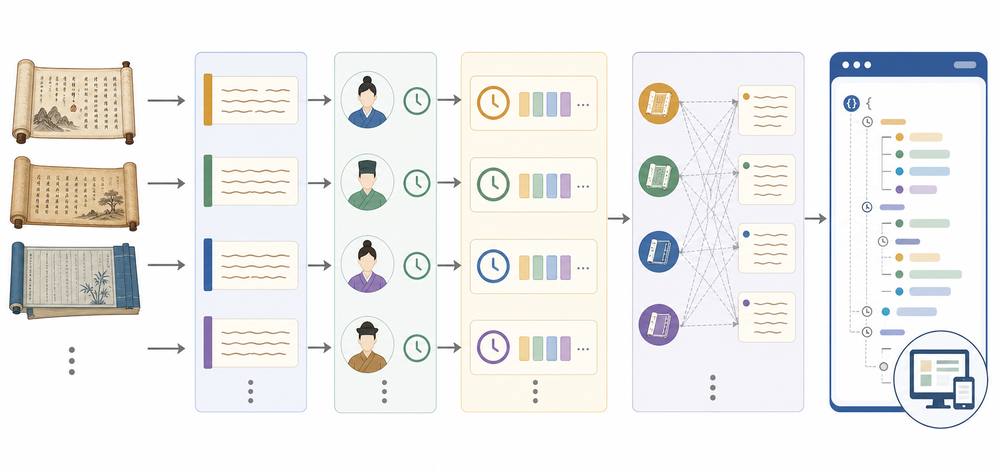
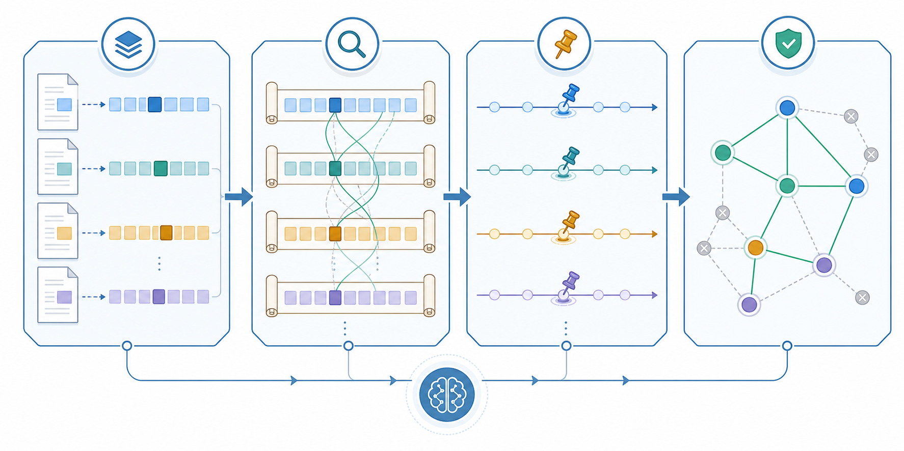

# AIH 可扩展全文 Agent

<p align="center">
  
</p>

**中文** | [English](README.md)

OpenAI、DeepSeek、Qwen、Gemini、Claude、本地推理服务及兼容网关共用同一套配置，详见[底层模型配置指南](../model-configuration.zh-CN.md)。

本指南说明面向平台的 AI Historian 执行 profile，它来源于 [Westlake Historian](https://westlakehistorian.com) 所使用的 Agent 系统。该 profile 把实验流水线扩展到完整文本与多文档集合，同时保留相同的 A1–A9 语义方法、TimeBlock 表示、来源追踪方式和证据核验规则。



## Runtime scope 设计

论文控制实验使用预先限定的小案例包；公开平台需要处理更长的全文。如果把所有文档中的所有候选 TimeBlock 一次性放入模型上下文，既不稳定，也难以扩展。因此，平台版增加了 runtime scope 层：先检索范围紧凑、包含时间锚点的 `episode_packet` 候选包，再在每个小范围内调用核心 A8/10B 核验器，并把通过核验的证据合并回完整运行结果。



这一调整解决上下文规模和全文执行问题，同时完整保留 AIH 的本质方法。实验版与平台版的严格边界见[两种 profile 的对照说明](../profiles.zh-CN.md)。

## 流程结构

1. Step 1–5 完成文本预处理和句子级 Agent A1–A4。
2. Step 6–9 构建 TimeBlock、补全时间标志物、恢复顺序并判断时间粒度。
3. A8/10A 为全文 TimeBlock 生成时间标志物。
4. runtime-scope runner 检索跨文档候选并构建 `episode_packet` 小范围输入。
5. A8/10B 在每个小范围中核验跨文本证据；通过核验的结果经过去重后合并回全文。
6. A8/10C–10D 稳定时间锚点并传播已核验的时间约束。
7. A9/Step 11 生成规范化时间范围。
8. Step 12–14 生成保留来源链路的应用数据和可读摘要。

### 内部时间阶段

时间推理核心被拆分为可单独检查的明确阶段：Step 10A 生成时间标志物；10B 在检索得到的小范围内核验带引文的跨文档证据；10C 稳定单文档时间锚点；10D 在时间图中传播通过核验的边界约束。Step 11 随后依次使用冻结映射表、确定性的年号换算和必要时的 LLM fallback 生成规范化时间范围。

## 环境配置

在仓库根目录运行：

```bash
uv sync --locked
cp .env.example .env
```

填写 `AIH_CHAT_PROVIDER`、`AIH_CHAT_MODEL` 和所选厂商对应的原生 API-key 变量，然后加载配置：

```bash
set -a
source .env
set +a
```

## 输入格式

把需要进行跨文本处理的 UTF-8 文本放在同一个目录中，文件名统一采用小写
kebab-case：

```text
liu-bang-synthetic-biography.txt
```

每个文件的 `person` 和 `title` 必须在同目录的 `manifest.json` 中明确声明，具体格式见[数据格式](../data-format.md)。空行用于分隔段落。内置书目表为已支持的历史文献提供稳定元数据；也可以通过 `AIH_BOOK_CATALOG` 指定自定义书目。书目表范围之外的文件会获得确定性集合标识符。

## 运行方式

```bash
uv run aih-fulltext path/to/input_texts --output runs/my_collection
```

默认启用跨文档 runtime scope。只运行单文档内部流程时使用：

```bash
uv run aih-fulltext path/to/input_texts \
  --output runs/my_collection \
  --skip-crossdoc
```

从指定阶段继续中断的任务：

```bash
uv run aih-fulltext path/to/input_texts \
  --output runs/my_collection \
  --resume-from 10
```

常用范围控制变量包括 `AIH_CROSSDOC_SCOPE_SELECTOR`、`AIH_CROSSDOC_SCOPE_MAX_CASES`、`AIH_CROSSDOC_SCOPE_TOP_K_PER_PAIR` 和 `AIH_CROSSDOC_SCOPE_CONTEXT_PAD`。默认参数对应平台部署使用的 `episode_packet` 执行方式。

## 输出与内容

每个阶段都会在指定运行目录下新建独立的 `sentence/`、`timeblock/` 或 `sequence/` 子目录，完整保留各步结果。runtime scope 报告和小范围输入也会保留，方便检查。Step 14 会在 `<run-root>/export/` 下生成应用集成数据。每次 CLI 运行还会写入 `run_manifest.json`，记录输入哈希、源码提交、非敏感配置和已完成阶段。

本目录提供可移植的 Agent 源码、时间参考映射、结构图片、runtime-scope 实现和应用导出接口。

论文报告的实验指标对应 [`../../experiments/`](../../experiments/) 中的冻结实验版材料。

## 反馈与贡献

贡献方式见 [`../../CONTRIBUTING.zh-CN.md`](../../CONTRIBUTING.zh-CN.md)。

欢迎反馈 runtime scope、跨文档检索、时间规范化、语料接入和复现过程中的问题与经验。提交 GitHub issue 时，建议附上运行命令、执行版本、相关路径和精简示例。我们也非常欢迎交流新的历史文献集合，并共同改进系统。
