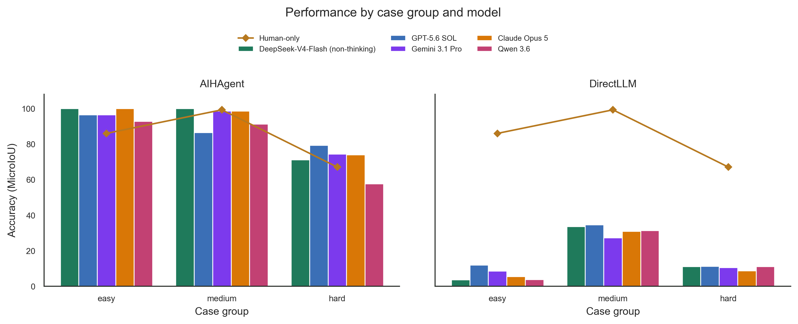

# Frozen result index

This index points to the frozen results used in the AIH paper workspace.

## Experiment 1: end-to-end temporal reconstruction

Scored task: six vernacular-Chinese *Shiji* cases, 249 source sentences, and 244 eligible sentence-level temporal ranges.

### Primary comparison

| Condition | Frozen artifact | Result represented |
| --- | --- | --- |
| AIH Agent | `experiments/experiment-1/results/ai-variant-score-experiment-1-ai-only-final-api-consensus.json` | Six case scores from the three-run row-level consensus; case-size-weighted MicroIoU reported in the paper: 86.2% |
| Human-only | `experiments/experiment-1/results/human/` | Public sentence-level responses, case scores, timing, and summary; paper result: 81.3% |
| Direct LLM | `experiments/experiment-1/direct-llm-results/generated_results_direct_llm_20260615_190423/` | Frozen baseline rows, timing, unresolved boundaries, and score inputs; paper result: 17.1% |
| Gold standard | `experiments/experiment-1/inputs/annotations/gold-iso-ranges.csv` | Adjudicated sentence-level month ranges loaded during scoring |

The complete AIH intermediate-state archive is under `experiments/experiment-1/results/generated_results_api_consensus_20260614_195059/`. Each case/run retains Step 1–11 sentence, TimeBlock, and sequence outputs, allowing a final range to be traced back to the source sentence and intermediate judgements.

The complete public human comparison package is under [`experiments/experiment-1/results/human/`](experiments/experiment-1/results/human/), including 249 Human-only responses, 249 Human+AI responses, case-level MicroIoU, and per-case timing.

### Multi-model replication

The consolidated five-model results are under `experiments/experiment-1/results/multimodel/`.

| Model | AIH Agent six-case macro MicroIoU | Direct prompting six-case macro MicroIoU |
| --- | ---: | ---: |
| DeepSeek-V4-Flash, non-thinking | 90.2% | 15.4% |
| GPT-5.6 SOL | 86.9% | 17.9% |
| Gemini 3.1 Pro | 88.6% | 14.6% |
| Claude Opus 5 | 90.7% | 14.3% |
| Qwen 3.6 | 78.6% | 15.0% |

These values are descriptive macro-averages of the six official case-level MicroIoU scores. The JSON file retains all case values, row counts, missing/unresolved counts, and source score paths.

## Experiment 2: diagnostic reasoning

The complete frozen package is under `experiments/experiment-2/`.

| Condition | Strict accuracy | Frozen artifacts |
| --- | ---: | --- |
| Human | 64.6% (62/96) | `experiments/experiment-2/results/human/` — raw-response link, field-level scores, grouped metrics, and timing |
| Direct LLM | 68.8% (33/48) | `experiments/experiment-2/results/direct-llm/` |
| Structured LLM | 75.0% (36/48) | `experiments/experiment-2/results/structured-llm/` |

The cross-text event-verification and temporal-alignment block reported in the paper is 75.0% for direct prompting and 91.7% for structured prompting. The frozen block-level values and timing are in `experiments/experiment-2/figure/experiment-2-strict-total-comparison-metrics.json`.

Use [`experiments/human-baselines.md`](experiments/human-baselines.md) as the public entry point for both human conditions and their direct AI/model comparisons.

## Inputs and algorithms

- Evaluation profile: `src/ai_historian/profiles/evaluation/`
- Scalable full-text profile: `src/ai_historian/profiles/scalable_fulltext/`
- Canonical era table: `src/ai_historian/resources/chinese_eras.csv`
- Canonical temporal string map: `src/ai_historian/resources/time_string_iso_map.json`
- Experiment 1 input packets and evaluation tables: `experiments/experiment-1/inputs/`
- Experiment 1 scoring algorithms: `experiments/experiment-1/evaluation/`
- Experiment 2 questions, answer keys, and response sheets: `experiments/experiment-2/inputs/`
- Experiment 2 generation/scoring algorithms: `experiments/experiment-2/code/`
- Combined six-participant source export shared by both experiments: `experiments/shared/human-study/`
